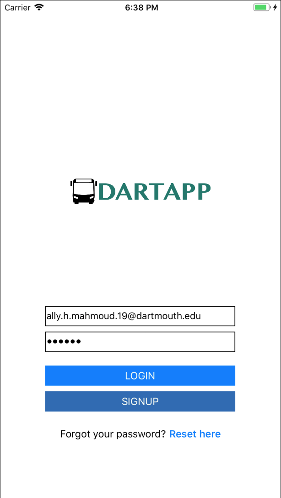
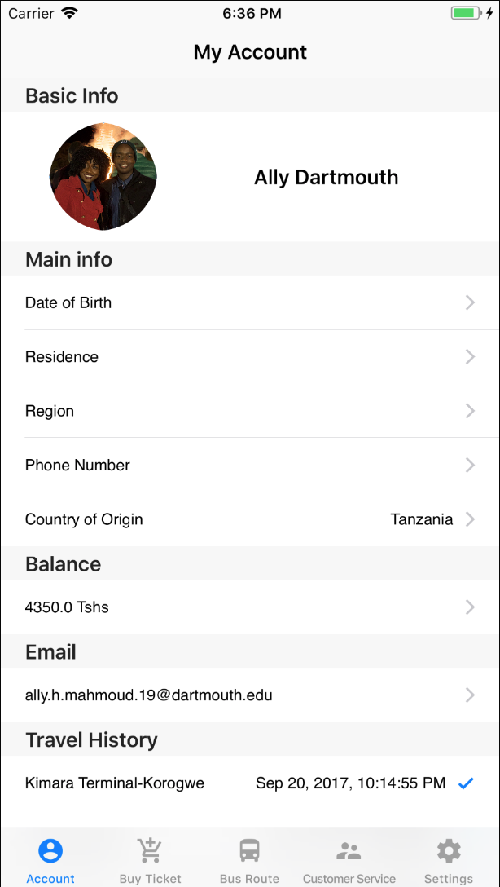
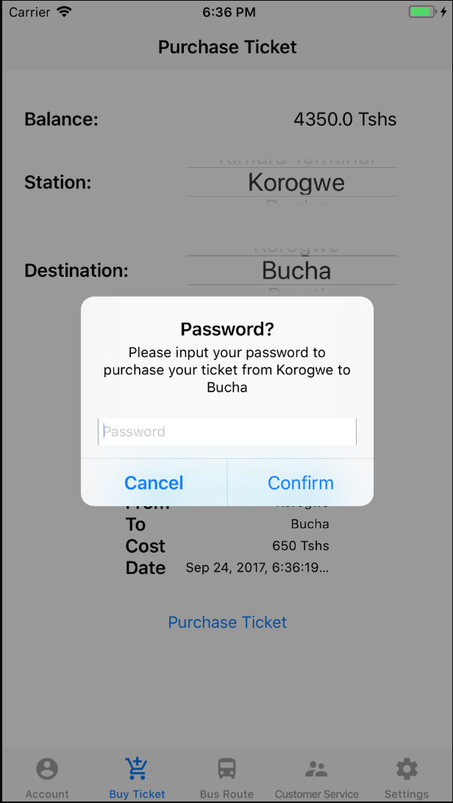
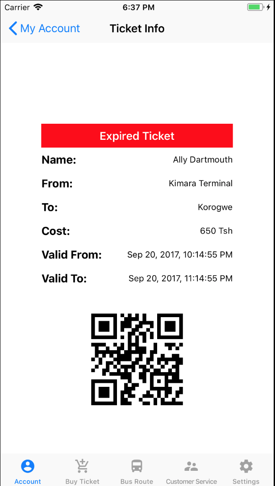
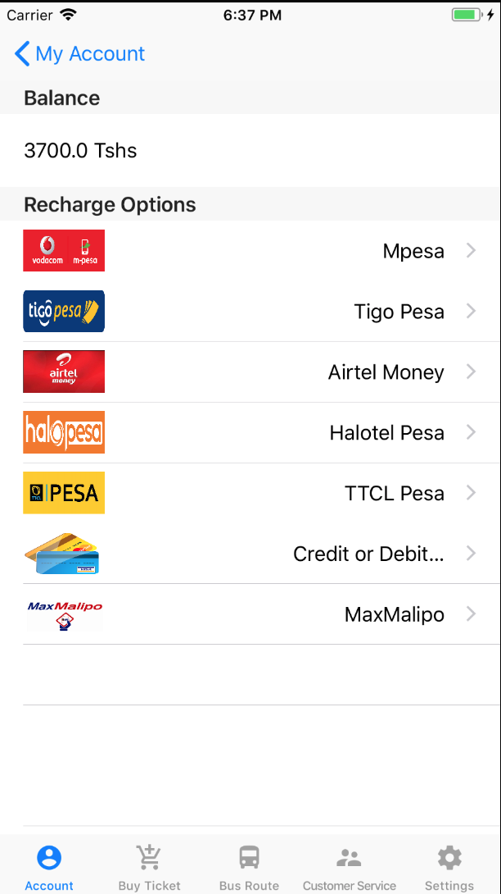
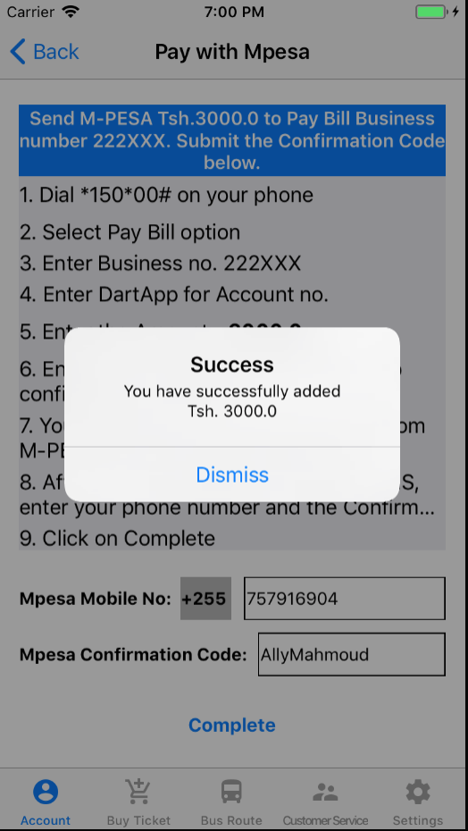
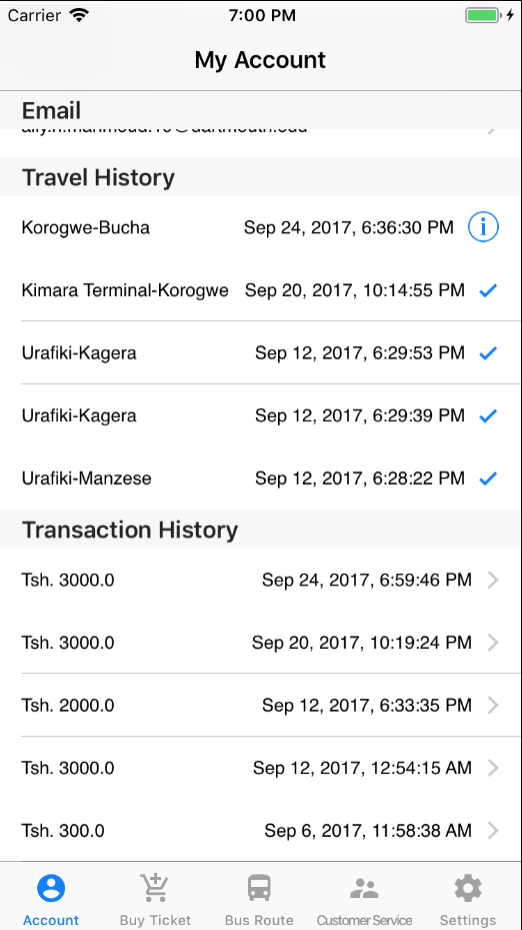

# DART APP
## Ally Mahmoud, August - September 2017

### 

**DART APP** is a mobile ticketing application that allows users of [Dar-es-Salaam Bus Rapid Transit(DART)](https://en.wikipedia.org/wiki/Dar_es_Salaam_bus_rapid_transit) to purchase DART bus tickets through the DART App in oppose as to have to queue for upto 30 mins on DART stations in order to purchase a single QR Code Ticket. 

### Usage
The DART APP offers a digital wallet with a balance that can be recharged through a credit/debit card or a [mobile phone-based money transfer](https://en.wikipedia.org/wiki/Mobile_banking) such as [Mpesa](https://en.wikipedia.org/wiki/M-Pesa). Once a DART APP user has recharged their DART App digital wallet balance, they will be able to purchase Qr Code tickets that can be scanned against Turnstile gates with QR Code reader at the DART bus stations.

### Importance
By offereing an alternative ticket purchase option through Android and iOS mobile apps, the DART App will improve the user experience of every DART customer by reducing the on-station long queues at peak hours, trouble to looking for a small change, and inconveniences that might arise from the loss or misplacement of the DART smart cards. 

### Screenshots
Login Page          |  Profile Page          |  Ticket Purchase Page          
:-------------------------:|:-------------------------:|:-------------------------:
  |   |   

Valid Ticket Page         |  Expired Ticket Page       |  Payment Options Page          
:-------------------------:|:-------------------------:|:-------------------------:
  |   |  

Pay With Mpesa Page            |  Transactions and Travel History 
:-------------------------:|:-------------------------:
  |  

   

##### ©2017 Ally Mahmoud. All Right Reserverd.
 

